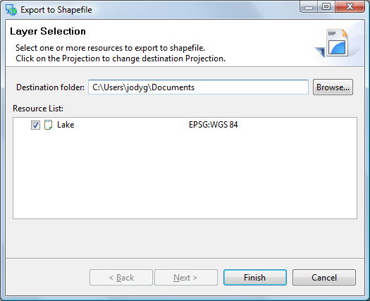
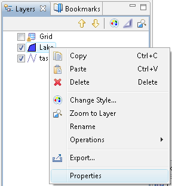

Save
=====

We are now going to save the “Scratch” layer we have been working with.

* Please press the
  Save
  button in the tool bar (or choose save from the File menu).

* Ensure that your scratch layer
  Lake
  is selected and press
  Finish
  .
  |100000000000020D000001AB11316DA2_png|

* A new shapefile has been created in the directory indicated, you can see this file in your catalog.
  |2000000700004D85000010DAA4FB2BFC_svm|

* Your map has been updated to use your new layer, you can verify this by right clicking on your Lake layer and checking its Properties.
  |10000000000001200000013658F9B55A_png|

.. |2000000700004D85000010DAA4FB2BFC_svm| image:: images/2000000700004D85000010DAA4FB2BFC.svm
    :width: 13.91cm
    :height: 3.02cm

