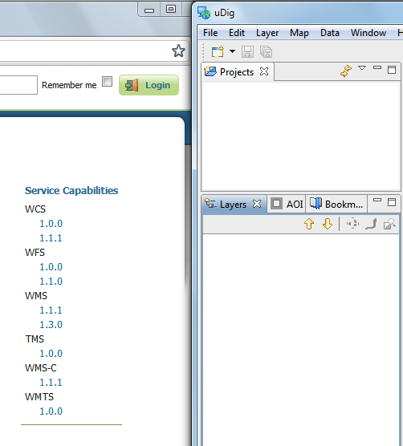
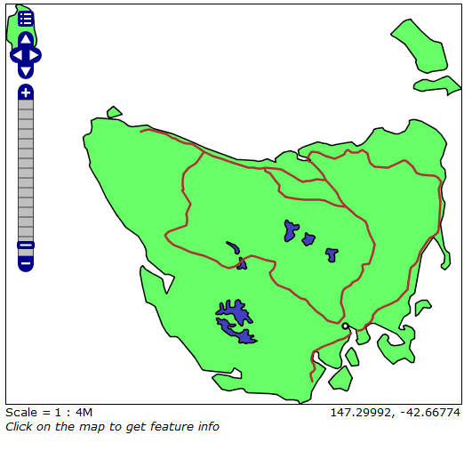
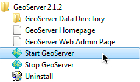
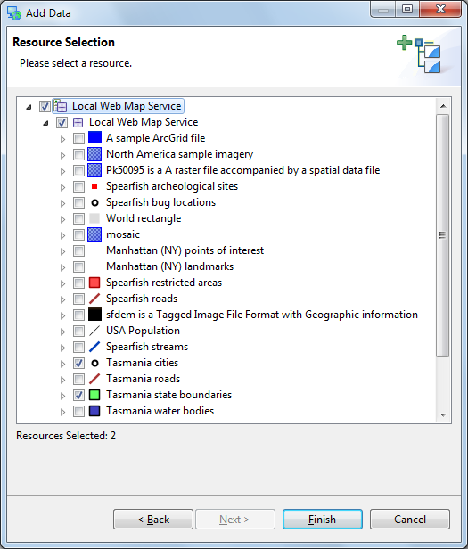
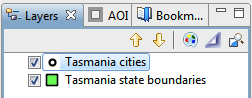
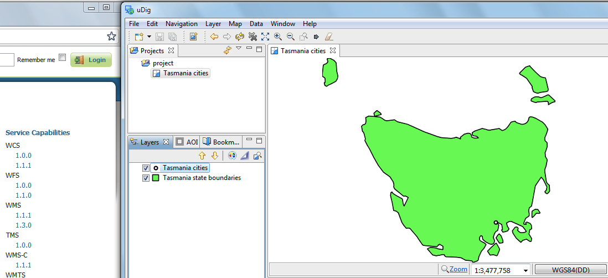
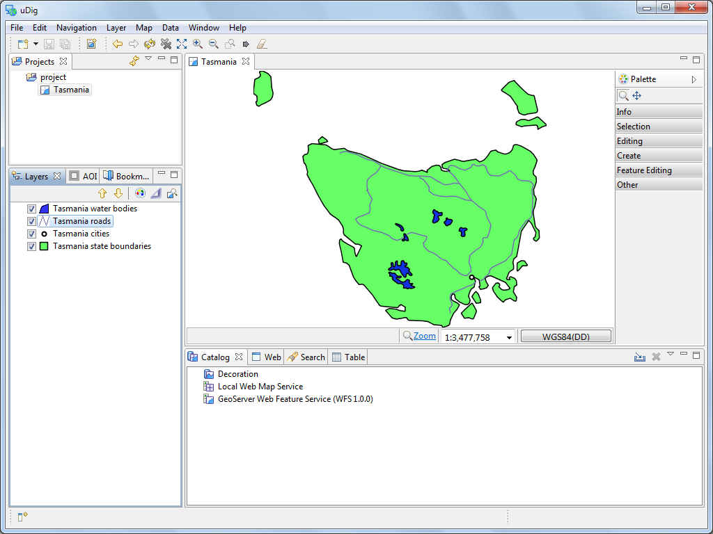

WMS and WFS Integration
-----------------------

In this section we will use uDig to display contents from our local Web Feature Server.
We will also make use of some of the more interesting selection features.

1. Start uDig, from the menubar select :guilabel:`File > New Map` to create a new map.

2. Make sure your local GeoServer is started and ready to go.
   
   You can run GeoServer from the Start menu.
 
   |10000000000000E60000008785B4FD09_png|

3. Navigate to the GeoServer :guilabel:`Welcome` page:
   
   * `http://localhost:8080/geoserver/ <http://localhost:8080/geoserver/>`_

4. Drag and Drop the :guilabel:`WMS 1.1.1 Capabilities` link on to your Map.

   |10000000000001F60000022CE8FD80B1_png|
  

5. This will bring up the :guilabel:`Add Data` wizard allowing you to choose which Layers
   are added to your map.
   
   Select:guilabel:`Tasmania state boundaries` and :guilabel:`Tasmania cities` and
   Press the :guilabel:`Finish` button.

   |100000000000020D00000268D3218E51_png|

* Move
  tasmania_cities_Type
  to the top of your layers view.
  |10000000000000FC00000062A77BE7DE_png|

* Drag and Drop the
  WFS 1.0.0 Capabilities
  link on to your Map.
  |100000000000044A000001F65B38C5D2_png|

* This will bring up a Dialog allowing you to choose which Layers you wish to see.
  Select
  Tasmania roads
  and T
  asmania water bodies
  and press the
  Finish
  button.
  |100000000000020D000001E47880A046_png|

* Select the Map in the projects view and choose
  File->Rename
  menu item.

* Rename to
  Tasmania.
  |100000000000040000000300AA4FBF5F_png|

* You can compare your map with what is shown by GeoServers layer preview for the Tasmania layer.
  |1000000000000213000001FBDDDD1626_png|

.. |100000000000020D000001E47880A046_png| image:: images/100000000000020D000001E47880A046.png
    :width: 9.721cm
    :height: 8.95cm

