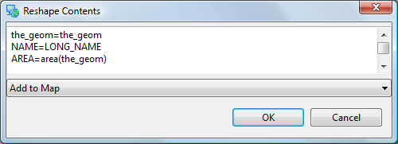

What to Do Next
===============

Where to go from here? Try out the following:

* You can use the
  Reshape
  operation reorder and rename attributes and even create new ones using simple formulas
  |10000000000001F4000000B54D9602C7_png|

* Enable Advanced Editing Tools in
  Windows > Preferences
  and see what ideas the developers are considering. You will need to close and open your map for the settings to take effect.

* The uDig community site has additional editing tools.
  Try out the tools provided by Axios.

