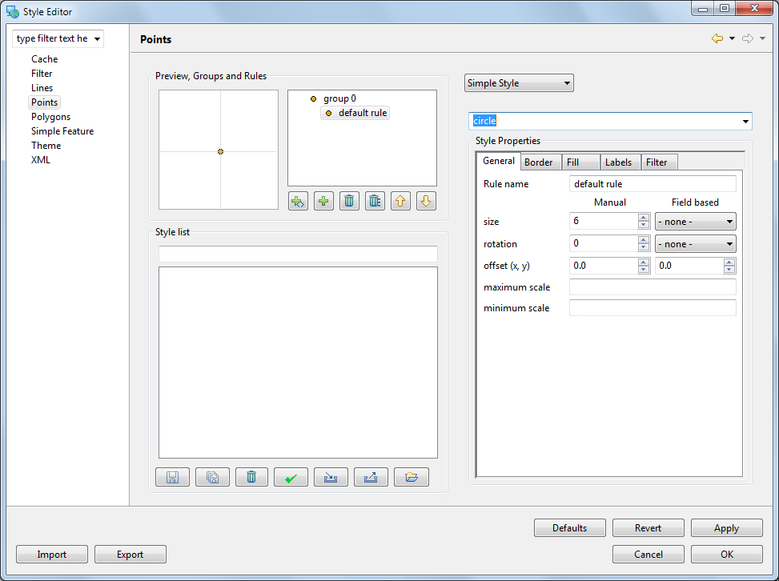
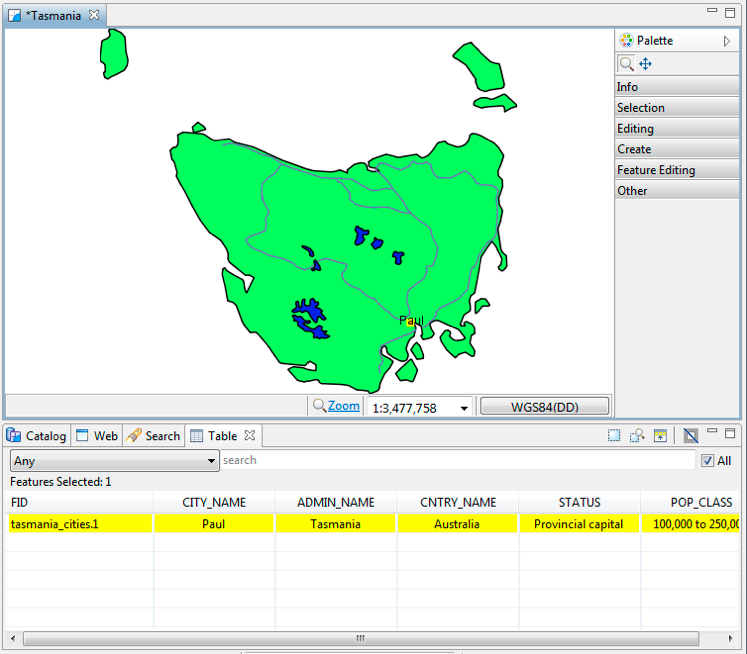
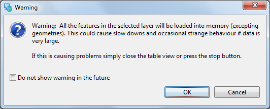
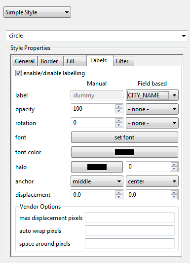
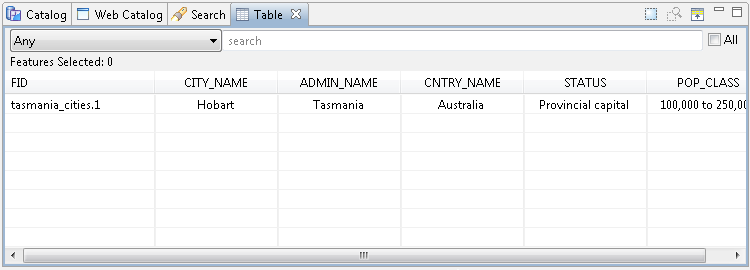

Working with Attributes
=======================

In this section you will learn how to edit an Attribute, along the way we will explore the use of styling.

To start out with lets figure out the name of that city:

* Select
  Navigation

  >

  Show All
  from the menu bar.

* Select the
  Tasmanian
  cities
  in the Layers View.
  |2000000700001A5C00000EC99F68F8D9_svm|

* Select the
  Edit > Delete
  command from the menu bar

* In the
  Catalog
  view expand the
  GeoServer Web Feature Service (WFS 1.0.0)

  entry and select
  T
  asmania cities
  .
  |2000000700004D9F00001830C95B81B4_svm|

* Right Click and select
  Add to Current Map
  .

* Right click on T
  asmania cities
  in the
  Layers
  view, and click on
  Change Style
  .
  |200000070000235A00001E2F7260F209_svm|
  This opens the
  Style Editor
  dialog.

* Define the point shape using style as follow:

* Select the
  Points
  page from the list on the left hand side of the
  Style Editor
  .

* Choose
  Simple Style
  to access the the built in shapes.

* |10000000000003CD000002D6317F97A2_png|
  Choose
  circle
  from the list of built in shapes.

* Configure the style properties for labeling:

* Click on the
  Labels
  tab

* Check the
  enable/disable
  labeling

* Choose
  CITY_NAME
  for the label property.
  |1000000000000181000002148DF89435_png|

* After making changes, hit the
  Apply
  button to update the map, you can experiment with the settings and press
  Close
  when you are finished.

* Ensure that
  T
  asmania cities
  is still selected in the layers view, and select the
  Table
  view.

* The first time you use table view you will need to accept a warning that all the features will be loaded into memory.
  |1000000000000214000000D8E5C9CDB2_png|

* The Table view shows all the features for the current layer.
  |10000000000002EE0000010E41AFEB49_png|

* Go ahead and rename the city after yourself. Change the CITY_NAME attribute and you can watch the map update.
  |10000000000002EB0000028E8B0BDDA9_png|

* Press the
  Commit Changes
  button, in the tool bar, to send your changes off to the Web Feature Server.

.. |2000000700001A5C00000EC99F68F8D9_svm| image:: images/2000000700001A5C00000EC99F68F8D9.svm
    :width: 4.701cm
    :height: 2.649cm

.. |2000000700004D9F00001830C95B81B4_svm| image:: images/2000000700004D9F00001830C95B81B4.svm
    :width: 13.91cm
    :height: 4.33cm

.. |200000070000235A00001E2F7260F209_svm| image:: images/200000070000235A00001E2F7260F209.svm
    :width: 6.331cm
    :height: 5.41cm

