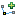

.. _what_is_new_1_1:

What is new for uDig 1.1
========================

.. contents:: :local:
   :depth: 1

Map Improvements
----------------

Editing Tools



.. figure:: ../images/what_is_new_1.1.0/remove_vertext_mode.gif
   :align: center
   :alt:

.. figure:: ../images/what_is_new_1.1.0/edit_vertex_mode.gif
   :align: center
   :alt:

.. figure:: ../images/what_is_new_1.1.0/hole_vertex_mode.gif
   :align: center
   :alt:
 
.. figure:: ../images/what_is_new_1.1.0/delete_feature_mode.gif
   :align: center
   :alt:

.. figure:: ../images/what_is_new_1.1.0/difference_feature_mode.gif
   :align: center
   :alt:

Editing tools have been revised for uDig 1.1. The new tools are more responsive and provide better
feedback.

+------------+------------+------------+------------+------------+------------+
| |image6|   | |image7|   | |image8|   | |image9|   | |image10|  | |image11|  |
+------------+------------+------------+------------+------------+------------+

In addition to a better user experience there is a complete framework to allow new tools to be
created. Please visit the community section for instructions on downloading *Axios uDig Extensions*
which feature a selection of advanced editing tools.

Scratch Layers
``````````````

You can define and create a new layer by selecting the :menuselection:`Layer --> Create` menu item. How ever it is
"In-Memory" and is not saved. You can export the layer to a shapefile if you wish to save your work.

Create New Feature Types
````````````````````````

Once you have a Service imported into the catalog you can select the service and select :menuselection:`Operations
--> Edit --> Create Feature Type` to define a new feature type in that service. For example: Import a
Shapefile. select the service in the catalog. Select :menuselection:`Operations --> Edit --> Create Feature Type` and
define the feature type. When you select "OK" a new Shapefile will be created that you can open and
paste features into from other layers or define new features using the edit tools.

Thematic Styling
````````````````


A dialog has been created for style modifications, including the ability to create a theme for a
layer based on attribute values.

.. figure:: ../images/what_is_new_1.1.0/themed_pop_density.gif
   :align: center
   :alt:

UDig includes a great set of ready-made palettes for creating thematic styling - thanks to the Penn
State's ColorBrewer research project! These palettes have been tested and can account for a range of
conditions from a map displayed on a projector; to a colour-blind audience.

Mylar
`````

The traditional use of Mylar in a concept familar to the GIS community, uDig will feature the
ability to "fade out" information to reveal the layer being worked with.

+-------------+-------------+
| |image14|   | |image15|   |
+-------------+-------------+

Table View
``````````

A Table Feature View has been added for viewing the features in the current selection. In the
default perspective it is one of the views hiding behind the CatalogView at the bottom.

.. figure:: ../images/what_is_new_1.1.0/selection_view.jpg
   :align: center
   :alt:

Feature Copy and Paste
``````````````````````

Features can now be copied and pasted between layers. However, layers, maps and projects cannot be
copied or pasted.

New Map Preferences
```````````````````

Some new preferences have been added for default map creation. For preferences choose the menu item:
:menuselection:`Window --> Preferences`. Some of the new preferences are:

-  Map Background color
-  Render transparencies (on is slower but more attractive)
-  Use Anti-aliasing (on is slower but more attractive)
-  Map Default CRS

Workflow Improvements
---------------------

Reshape Operation
`````````````````

The reshape operation can be used to manipulate your data in an ad-hoc manner. The reshape operation
allows you to list the attributes of the output you desire; defining each attribute using a short
:doc:`/concepts/Constraint Query Language` expression.

-  To include a column of data; list the attribute name - with the same attribute name as the
   expression
   DESCRIPTION=DESCRIPTION
-  To rename a column of data; list the new attribute name - with the origional attribute name as
   the expression
   NOTE=DESCRIPTION
-  To add a column of data; create an attribute with a constant literal value.
   VERSION=1.0
-  To calculate a column of data; create an attribute with an expression
   DENSITY=POPULATION/area(THE\_GEOM)
-  To remove a column of data; simply don't include it in your output

The Reshape operation can be performed on any vector data.

Tasks View
``````````

Tasks can be created from features as reminders of tasks that must be done. Tasks are maintained
between runs and can be configured to be stored in a shared Postgis database for collaborative work.

Validation
``````````

Validation operations have been added too. Now you can validate a layer to conform to a series of
tests you customize, and the failed features are displayed in an Tasks view.

Bookmarks View
--------------

A handy view has been added that allows locations to be bookmarked so that one can easily return to
the locations at a later date. (Thanks Cole)

Data Handling Improvements
--------------------------

Web View
````````

A new view has been added that has a browser embedded within it. Clicking on a link or dragging and
dropping the link will load the linked layers in the current map or open a new map.

Location View
`````````````

A "location" view has been added. The view allows an address to be entered and will show a list of
matches. Clicking on a match will center the map on that address and flash a point at that location.

Export
``````

You can now export into a range of formats:

-  Image Export; no need to take a screen snap - directly export to an Image.
-  PDF Export: just like another image format; export what is on the screen to a PDF file
-  Shapefile Export: export data from any source into a locale shapefile; great for working with
   information from a slow web feature server on the other side of the world.

Max OSX
-------

Some of the major bugs with on Macintosh computers have been fixed.

The most notable are the problems restarting uDig and dragging and dropping work. There are a couple
caveats on Macintosh; you cannot drop into the editor area when a map is not open. You can however
drop on to empty or non-empty maps and onto the Layers View for the same effect.

And much more
-------------

-  Distance Tool added.
-  Custom CRS objects entered are persisted for future use.
-  Custom keywords can be added to CRSs in CRS Chooser for more convenient look up.
-  Added dialog for easy submission of error logs to uDig development team.

.. |image0| image:: ../images/what_is_new_1.1.0/new_point_mode.gif
.. |image1| image:: ../images/what_is_new_1.1.0/new_line_mode.gif
.. |image2| image:: ../images/what_is_new_1.1.0/new_polygon_mode.gif
.. |image3| image:: ../images/what_is_new_1.1.0/new_rectangle_mode.gif
.. |image4| image:: ../images/what_is_new_1.1.0/new_circle_mode.gif
.. |image5| image:: ../images/what_is_new_1.1.0/new_freehand_mode.gif
.. |image6| image:: ../images/what_is_new_1.1.0/new_point_mode.gif
.. |image7| image:: ../images/what_is_new_1.1.0/new_line_mode.gif
.. |image8| image:: ../images/what_is_new_1.1.0/new_polygon_mode.gif
.. |image9| image:: ../images/what_is_new_1.1.0/new_rectangle_mode.gif
.. |image10| image:: ../images/what_is_new_1.1.0/new_circle_mode.gif
.. |image11| image:: ../images/what_is_new_1.1.0/new_freehand_mode.gif
.. |image12| image:: ../images/what_is_new_1.1.0/mylar_mode.gif
.. |image13| image:: ../images/what_is_new_1.1.0/mylar_focus_co.gif
.. |image14| image:: ../images/what_is_new_1.1.0/mylar_mode.gif
.. |image15| image:: ../images/what_is_new_1.1.0/mylar_focus_co.gif
