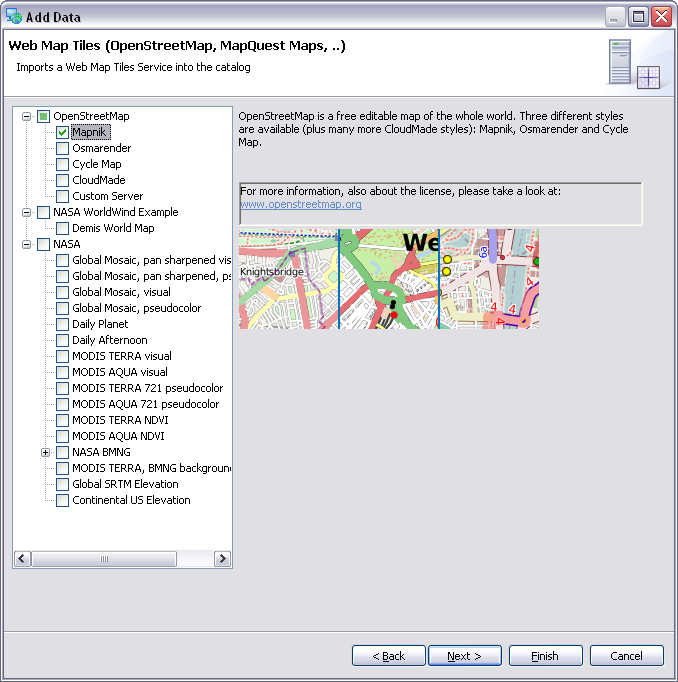

.. _what_is_new_1_2:

What is new for uDig 1.2
========================

.. contents:: :local:
   :depth: 1

Terradata
---------

Support for the Terradata database has been provided.

* :doc:`../reference/Teradata page`

Spatial Toolbox
---------------

Spatial toolbox has arrived allowing access to a vast range of spatial functionality provided by
through Open Modeling Services 3 components.

For more information:

* :doc:`../getting_started/Introduction to the Spatial Toolbox` covers the installation and use of JGrass compoenents
* :doc:`../reference/Spatial Toolbox View`

Generic DataStore
-----------------

The GeoTools library provides access to more data formats than we have created customer wizards for.
In the interests of encourage adopting and testing of new technologies we have created a "generic"
GeoTools DataStore wizard allowing you to try out ... everything.

* :doc:`../reference/DataStore page`

Improved Tools for working with Raster Data
-------------------------------------------

A couple of tools have been added for working with raster data:

-  Info Tool is now able to work with raster data
-  Profile Tool

Additional Export wizards
-------------------------

The :doc:`../reference/Export Wizard` allows you to export new kinds of information from the
uDig catalog for use in other applications.

-  Export coverage to tiff or esri ascii
-  Export feature layer to kml

These are export wizards available from the :menuselection:`File --> Export` menu.

Additional Import wizards
-------------------------

The :doc:`../reference/Import Wizard` allows you to import new kinds of information into the
uDig catalog for use.

-  Allows the easy creation of an image moasic from a directory of images
-  Import CSV files directly
-  Convert a KML file to a Shapefile

These are import wizards available from the :menuselection:`File --> Import` menu.

* :doc:`/reference/Import Wizard`

New Style Editor Pages
----------------------

A great series of new style editor pages has been created showcasing the power of the rendering
engine.

* :doc:`../reference/Raster Style Pages`

* :doc:`../reference/Feature Style Pages`

.. figure:: ../images/what_is_new_1.2.0/Simple-Points-Screen.jpg
   :align: center
   :alt:

Additional Raster Formats
-------------------------

A great improvement is the ability to work with additional raster formats, and working with images
larger then memory.

-  GeoTiff
-  World Image (JPEG, GIF, PNG, etc...)

On select platforms:

-  ECW
-  MrSID

Tile Server Support
-------------------

This release provides support for Web Map Server Caching (WMS-C) allowing access to tile servers
such as GeoWebCache and TileCache.

* :doc:`../reference/NASA WorldWind page`

* :doc:`../reference/Web Map Server Tile Cache page`

* :doc:`../reference/Web Map Tiles page`

WFS 1.1.0 Support
-----------------

Thanks to OpenGeo for implementing WFS 1.1.0 support. You can now specifiy WFS=1.1.0 in your
capabilities connection URL to work with servers supporting this standard.

This feature does not support WFS-T at this time.

Experimental Tiled Renderer
---------------------------

You can turn on Tiled rendering (as an option in preferences). When combined with the new flicker
free panning tool results in a nice sliding map experience.

ArcSDE
------

The ArcSDE support has been rewritten from the ground up in collaboration between OpenGeo and
Refractions. The new implementation is threaded allowing for a responsive user interface experience.

Advanced Symbology
------------------

The rendering system has received a great many enhancements:

-  Advanced Symbology including Hatches and True Type Font support
-  Style Layer Descriptor document no longer includes defaults resulting in a smaller file

Advanced "Vendor Specific Options":

-  Text to flow along a line
-  Geometry functions

Framework Improvements
----------------------

For the developer community using uDig as a platform for custom applications:

-  We have migrated to a modern version of the GeoTools library - bringing in five years of new
   developments in standard support, and a host of new raster and vector formats.
-  Addition ImageIO-ext project allowing the use of raster formats supported by GDAL.

