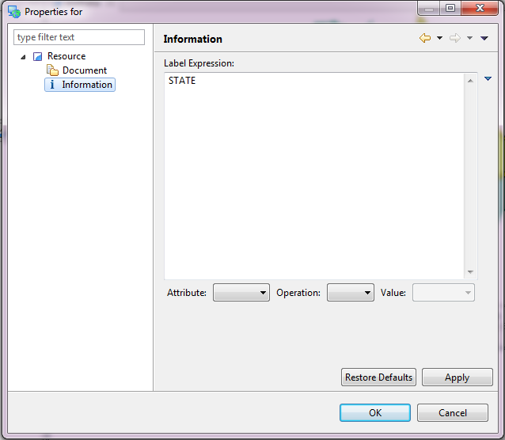

.. _what_is_new_1_3:

What is new for uDig 1.3
========================

.. contents:: :local:
   :depth: 1

New Property Pages
------------------

* :doc:`../reference/Resource Information page`: Use an :doc:`../reference/Expression viewer` to configure how each feature should be labeled.
  This allows the :doc:`../reference/Information view` and :doc:`../reference/Document view` to list features by name (rather
  than ID).
* :doc:`../reference/Resource Information page`: Configure document and hotlink support for a resource
* :doc:`../reference/Resource page`
* :doc:`../reference/Service page`

SLD 1.1
-------

Style import has been upgraded to support Style Layer Descriptor 1.1 (and Symbology Encoding 1.1).

This functionality is available by:

- Dragging an SLD file directly onto your layer
- Using the :guilabel:`Import` directly form the :doc:`../reference/Style Editor dialog`

New Edit Tools
--------------

The Axios tools formally installed as a separate download are now included in the default set of :doc:`../reference/Edit Tools`.

Constraint Query Language
-------------------------

The use of :doc:`/concepts/Constraint Query Language` has been greatly improved with fields providing
dynamic assistance and function lookup while you type.

To access this functionality:

- Constrain the data made avaialble to a layer using the :guilabel:`Query` page (accessed via layer properties).
- To quickly limit just the map display use the :guilabel:`Filter` page of the :doc:`../reference/Style Editor dialog`.
- Process your data using CQL Expressions using the :doc:`../reference/Transform dialog`

Transform Dialog
----------------

The :doc:`../reference/Transform dialog` offers a great user interface to process and transform your data.

Here are some task pages to get you started:

* :doc:`/tasks/Adding a column to a shapefile`
* :doc:`/tasks/Processing the Geometry in a Shapefile`

Area of Interest
----------------

We now support the concept of :doc:`/concepts/Area of Interest`:

-  This replaces the previous default value of "everything"
-  You can define an area of interest a number of different ways: current screen, a bookmark, the
   current projection
-  You can use Area of Interest to:

   -  Quickly filter a layer using the :guilabel:`Filter` page of the :doc:`../reference/Style Editor dialog`.
   -  Quickly filter the contents of the :doc:`../reference/Table view`
   -  Define the area searched in the :doc:`../reference/Search view`
   -  Set the extent used by :guilabel:`Show All`

For more information check out the Tasks section on :doc:`/tasks/Working with AOI`

Tool Interaction
----------------

You can now control how a layer interacts with tools using the :doc:`../reference/Interaction Properties page`.

This facility is to quickly mark background layers so they do not get in the way of
what you are working on.

Tool Palette and Options
------------------------

Tools have gotten a major usability improvement featuring:

-  **ToolPalette** - used to quickly explore available tools, configure tool display to show labels,
   large icons or even descriptions for a helping hand when learning.

   |image0|

   By default the Palette is displayed along side your Map; you can also Choose :menuselection:`Show View --> Other`
   and Open the Palette on its own as a tear off View. This is great for users with more than one monitor or when
   you have multiple maps open side by side. This is the same Palette used during Page printing.

-  **ToolOptions** - quick access to common tool preferences from the Map Status Line. This has
   allowed us to reduce the number of tools while maintaining the same functionality.

   |image1|

   These change combine to make uDig even more User-friendly with a presentation of tools similar to
   a paint program.

Cheatsheets
-----------

Cheatsheets offer a great form of interactive help to supplement the existing uDig online help
reference material.

|image2|

Cheatsheets offer step by step instructions; with the ability to interactively take charge of the
application and show you the step that is being described.

.. |image0| image:: ../images/what_is_new/PaletteSettings.jpg
.. |image1| image:: ../images/what_is_new/PanToolOptions.jpg
.. |image2| image:: ../images/what_is_new/uDigCheatsheet.jpg
