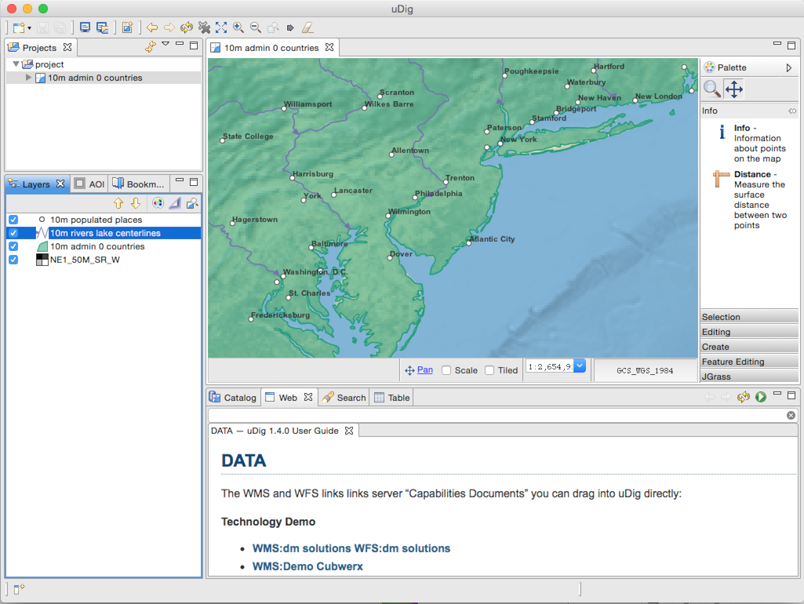
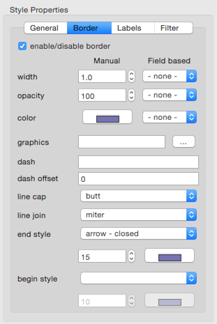

.. _what_is_new_1_5:

What is new for uDig 1.5
========================

The following features are new for the uDig 1.5 series.

.. contents:: :local:
   :depth: 1

Web Page updates
-----------------

The web view down points to a GitHub page (rather than a wiki page). Thanks to Frank for this work.

Arrow Support Style Editor
--------------------------

The style editor now supports arrows (as shown in the above map). Thanks to Emily and Refractions for this work.

Language and Internationalization
---------------------------------

Korean support has been added, thanks to Minpa Lee.

Spot a translation mistake or like to add support for your preferred language? Help translate here: `uDig latest localizations <https://www.transifex.com/projects/p/udig/>`_
